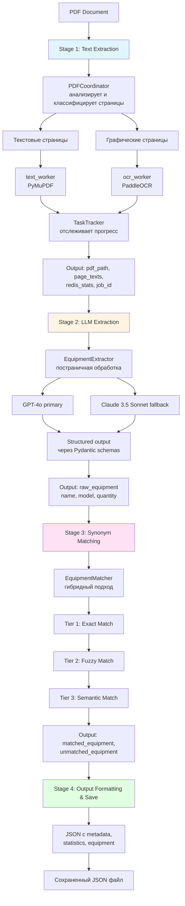

# HVAC Equipment Extraction System

Автоматизированная система извлечения данных об оборудовании из PDF-документов с использованием OCR, LLM и векторного поиска.

## Описание системы

Система представляет собой распределенный пайплайн обработки PDF-документов, который:

1. **Извлекает текст** - анализирует страницы PDF и извлекает текст напрямую (для текстовых страниц) или через OCR (для изображений)
2. **Распознает оборудование** - использует LLM (GPT-4o/Claude) для структурированного извлечения данных об оборудовании (название, модель, количество)
3. **Сопоставляет синонимы** - нормализует названия оборудования через гибридный поиск (точное совпадение → fuzzy match → семантический поиск по векторным эмбеддингам)
4. **Формирует результат** - сохраняет структурированный JSON с метаданными, статистикой и списком оборудования

### Архитектура

- **Redis (Valkey)** - очереди задач для распределенной обработки страниц
- **Qdrant** - векторная база данных для семантического поиска синонимов
- **RQ Workers** - воркеры для параллельной обработки (text_worker для текстовых страниц, ocr_worker для графических). Позволяют **значительно сократить время обработки** за счет распределения нагрузки между несколькими процессами
- **PaddleOCR** - современная VLM на базе трансформеров, обеспечивает высокое качество распознавания за меньшее время, работает локально без внешних API
- **Coordinator** - координатор пайплайна, управляет всеми этапами обработки

### Workflow




# Запуск системы в Docker

## Предварительные требования
- Docker и Docker Compose установлены
- PDF файлы находятся в папке `./pdfs`

## Быстрый старт

### 1. Настройка окружения
```bash
# Скопируйте .env.example в .env
cp .env.example .env

# Отредактируйте .env и укажите ваши API ключи:
# - OPENAI_API_KEY
# - ANTHROPIC_API_KEY
```

### 2. Запуск системы
```bash
docker compose up -d
```

Это запустит:
- Redis (Valkey) - очередь задач
- Qdrant - векторная база для синонимов
- qdrant-init - инициализация синонимов (запустится автоматически после готовности Qdrant)
- 2 воркера для обработки текстовых страниц
- 2 воркера для OCR-обработки

### 3. Запуск обработки PDF

```bash
docker compose run --rm coordinator python run_pipeline.py pdfs/your_file.pdf
```

Эта команда запустит пайплайн обработки указанного PDF файла. Воркеры автоматически подхватят задачи из очередей и обработают страницы.

**Результат**: JSON файл с извлеченным оборудованием сохраняется в `./output/{pdf_name}_equipment_{timestamp}.json`

## Мониторинг

Просмотр логов воркеров:
```bash
docker compose logs -f text-worker ocr-worker
```

Проверка статуса очереди (подключитесь к Redis):
```bash
docker exec -it pdf_valkey valkey-cli
> LLEN text_page_queue
> LLEN ocr_page_queue
```

## Остановка системы

```bash
docker compose down
```

Для удаления данных (Redis и Qdrant):
```bash
docker compose down -v
```

## Структура volumes

- `./pdfs` → `/app/pdfs` (read-only) - входные PDF файлы
- `./output` → `/app/output` - результаты обработки (JSON файлы)
- `./temp` → `/app/temp` - временные файлы
- `./data/redis` → `/data` - данные Redis/Valkey
- `./data/qdrant` → `/qdrant/storage` - векторная база Qdrant
